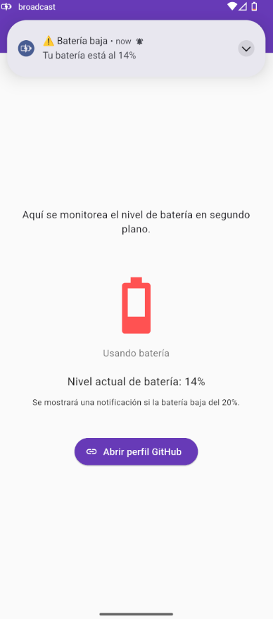

# 🔋 Battery Monitor

Aplicación Flutter que monitorea el nivel y estado de la batería en segundo plano, mostrando notificaciones cuando la batería está baja. Implementada siguiendo la arquitectura **MVVM** y usando **Provider** para manejo de estado.

#### 👩‍💻 Autora  
**Natalie Fernández**

---

## ✨ Características de la aplicación

- Monitoreo en tiempo real del nivel de batería y su estado (cargando, descargando, batería llena).
- Notificaciones automáticas cuando la batería baja del 20%.
- Iconos y textos dinámicos según el estado de la batería.
- Botón para abrir perfil de GitHub.
- Arquitectura **MVVM** para una separación clara de responsabilidades.
- Manejo de permisos para notificaciones.
- Código modular dividido en carpetas `view`, `viewmodel` y `services`.

---

## 🛠 Tecnologías usadas

- [Flutter](https://flutter.dev/)
- [Provider](https://pub.dev/packages/provider) – gestión de estado
- [battery_plus](https://pub.dev/packages/battery_plus) – nivel y estado de la batería
- [flutter_local_notifications](https://pub.dev/packages/flutter_local_notifications) – notificaciones locales
- [url_launcher](https://pub.dev/packages/url_launcher) – abrir enlaces externos

---

## 📁 Estructura del proyecto

lib/
├── main.dart
├── view/
│ └── broadcast_app.dart
├── viewmodel/
│ └── battery_viewmodel.dart
└── services/
├── battery_service.dart
└── notification_service.dart